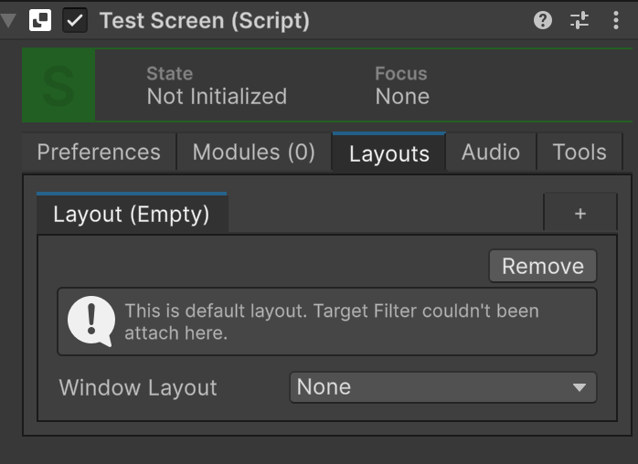
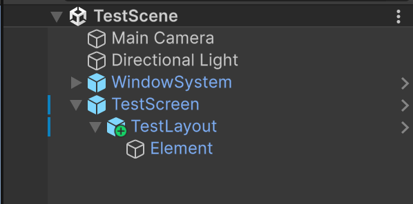
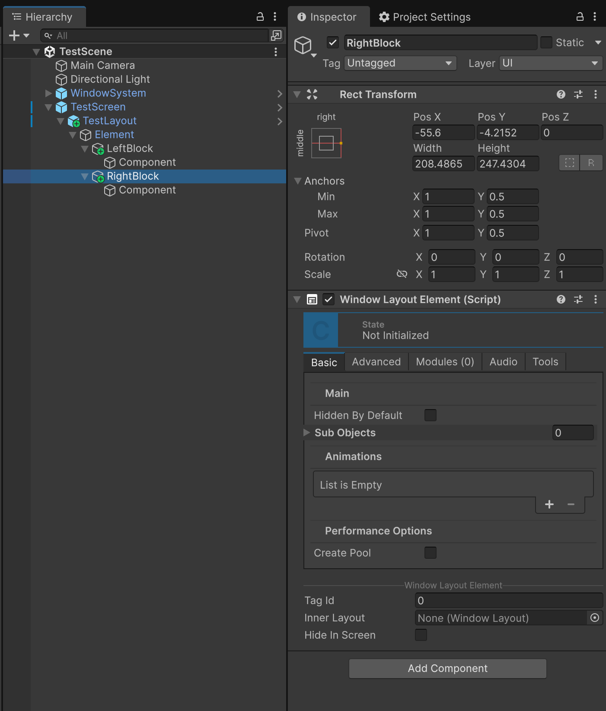
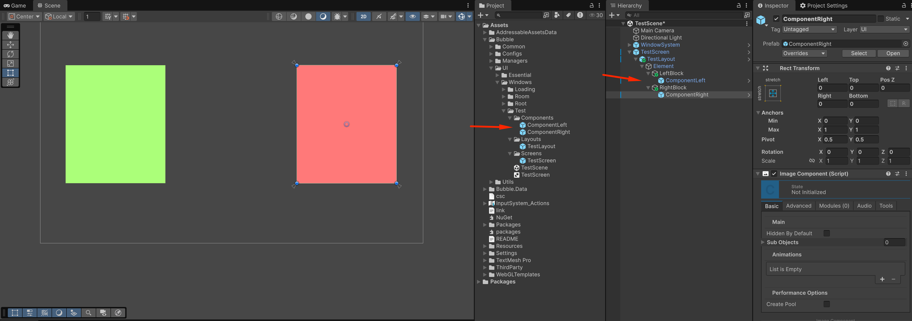
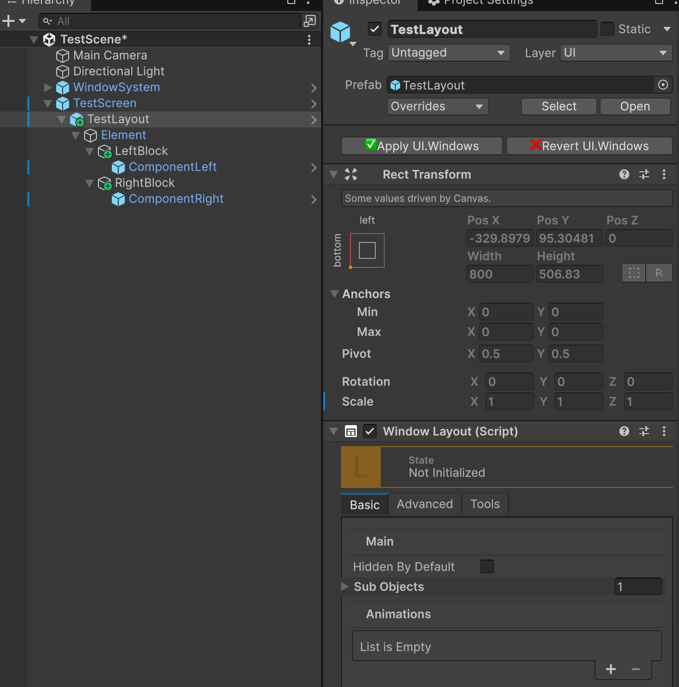

# Suggested screen editing workflow

Create the screen through the assets menu
```aiignore
Create -> UI.Windows -> Create Screen 
```

Create new layout through the screen's component `Layouts` tab



Create new scene. Put there prefabs:
- `WindowSystem` prefab
- Created screen prefab
  - Created layout prefab



Now you can build screen according to preferable design

For example: I put 2 `WindowLayoutElement` blocks into the `TestLayout/Element`



Then I created inner components and stored them as prefabs



Now I can save layout/screen prefabs changes ignoring components using `✅Apply UI.Windows` button:

- If you use `✅Apply UI.Windows` on the screen prefab (derived from `LayoutWindowType`), screen prefab will be applied ignoring inner layout
- If you use `✅Apply UI.Windows` on the layout prefab (`WindowLayout` type), layout prefab will be applied ignoring inner components (derived from `WindowComponent` but excluding `WindowLayoutElement` components)

- Button `❌Revert UI.Windows` works in the similar way - it reverts prefab's changes, but DON'T remove spawned inner components



# Summary
- You can edit each screen on it's own scene
- You can apply (or revert) screen/layout prefab changes ignoring inner components
- You can quickly return back to the screen editing as it's stored in the built state on the editing scene
  - Each time you apply screen/layout prefabs, they are stored without any components garbage